```mermaid
flowchart LR
  subgraph CLIENT["CLIENT"]
    A["User Uploads Images via FastAPI"]
    B["FastAPI reads image bytes"]
    C["read_and_pad_images → NumPy array"]
    D["gRPC call to Triton InferenceServer: ensemble_model"]
  end

  subgraph subGraph1["TRITON SERVER"]
    E["Ensemble Model receives RAW_IMAGE"]
    F1["Step 1: Preprocessor Model"]
  end

  subgraph subGraph2["TRITON PREPROCESSOR - Python Backend"]
    G1["Decode JPEG with OpenCV"]
    H1["Convert BGR → RGB → Torch Tensor"]
    I1["Apply transforms: Resize → ToImage → Normalize"]
    J1["Move to CPU → Convert to NumPy"]
    K1["Output: PREPROCESSED_IMAGE"]
  end

  subgraph subGraph3["CLASSIFIER - TorchScript"]
    F2["Step 2: Classifier Model"]
    G2["Run forward pass"]
    H2["Generate prediction"]
  end

  subgraph CLIENT_RESPONSE["CLIENT_RESPONSE"]
    I["Return prediction to FastAPI"]
    J["FastAPI sends JSON response to user"]
  end

  A --> B --> C --> D
  D --> E --> F1
  F1 --> G1 --> H1 --> I1 --> J1 --> K1 --> F2
  F2 --> G2 --> H2 --> I --> J
```

# 🧠 Triton Inference Server Deployment Guide

This guide walks through deploying an image classification pipeline using an ensemble model in NVIDIA Triton Inference Server. The architecture offloads preprocessing to a Python backend and classification to a TorchScript model.

## 📚 Table of Contents

1. [🧠 Triton Inference Server Deployment Guide](#-triton-inference-server-deployment-guide)
2. [📈 Inference Pipeline Diagram](#-mermaid-inference-pipeline)
3. [📁 Triton Model Repository Structure](#-triton-model-repository-structure)
4. [🛠️ Model Configurations](#-model-configurations)
   - [🔧 Preprocessor Config](#preprocessconfigpbtxt)
   - [🧠 Classifier Config](#classifierconfigpbtxt)
   - [🔗 Ensemble Config](#ensemble_modelconfigpbtxt)
5. [🚀 Run the Server](#run-the-following-docker-command-to-start-the-triton-inference-server-on-a-specific-gpu)
6. [⚙️ Arguments Explained](#arguments-explained)
7. [📦 Sample Client Snippet](#sample-client-snippet)
8. [🧪 Debugging Tips](#debugging-tips)
9. [⚠️ Limitations](#limitations)





## 🚀 Quick Start


Before starting a server we need to ensure the Repository structure is correct

### Triton Model Repository Structure

The Repository structure depends on the model,

#### pytorch_libtorch 

For a pytorch_libtorch model, organize your repository as:
```protobuf
models/
├── ensemble_model/
│   ├── config.pbtxt
├── preprocessor/
│   ├── 1/
│   │   └── model.py
│   └── config.pbtxt
└── classifier/
    ├── 1/
    │   └── model.pt
    └── config.pbtxt

```

### preprocess/config.pbtxt
```protobuf
name: "preprocess" 
backend: "python"
max_batch_size: 4096

input [
  {
    name: "RAW_IMAGE"
    data_type: TYPE_UINT8
    dims: [-1]
  }
]

output [
  {
    name: "PREPROCESSED_IMAGE"
    data_type: TYPE_FP32
    dims: [ 3, 224, 224 ]
  }
]

instance_group [
  {
    kind: KIND_GPU
  }
]

dynamic_batching {
  preferred_batch_size: [8, 16, 32, 64]
  max_queue_delay_microseconds: 100
}
```

### classifier/config.pbtxt

```protobuf
name: "classifier" 
platform: "pytorch_libtorch" # To tell which backend to use
max_batch_size: 4096 # Maximum Batch Size to expect

instance_group [
  {
    count: 2  # To tell how many copies of the model you want
    kind: KIND_GPU # CPU or GPU
    gpus: [0, 1]  # How many GPU to expect. [0] means one 1 GPU
  }
]

dynamic_batching { # Change this according to your needs
  preferred_batch_size: [32, 64, 128, 256, 512, 1024]
  max_queue_delay_microseconds: 100
}

input [  # Change this according to your model
  {
    name: "input__0"
    data_type: TYPE_FP32
    format: FORMAT_NCHW
    dims: [3, 224, 224]
  }
]

output [ # Change this according to your model
  {
    name: "output__0"
    data_type: TYPE_FP32
    dims: [5]
  }
]

response_cache {  # Optional
  enable: true
}
```


### ensemble_model/config.pbtxt

```protobuf
name: "ensemble_model"  # Name of the ensemble model exposed to Triton clients

platform: "ensemble"  # Specifies this is an ensemble model, not a standard ML model

input [  # Define the input expected by the ensemble pipeline
  {
    name: "RAW_IMAGE"  # Input name exposed to the client, matches the input of the first step (preprocessor)
    data_type: TYPE_UINT8  # Raw image bytes (e.g., JPEG/PNG in bytes)
    dims: [ -1 ]  # Flat bytes array per image; handled by the preprocessor Python backend
  }
]

output [  # Final output of the ensemble pipeline that gets returned to the client
  {
    name: "output__0"  # Must match the output name from the final step (classifier model)
    data_type: TYPE_FP32  # Probabilities or logits output (e.g., for classification)
    dims: [5]  # Example: 5-class classification output
  }
]

ensemble_scheduling {  # Defines the flow of inference across multiple models in this pipeline
  step [  # Ordered steps to execute models sequentially

    {
      model_name: "preprocessor"  # First step: Python backend model that decodes and preprocesses image
      model_version: -1  # Use the latest version available

      input_map {  # Maps the ensemble input to the preprocessor model's input
        key: "RAW_IMAGE"  # Preprocessor model's input
        value: "RAW_IMAGE"  # Connect it to the ensemble input
      }

      output_map {  # Maps the output of the preprocessor to the next step
        key: "PREPROCESSED_IMAGE"  # Preprocessor model's output
        value: "input__0"  # Connects to the input of the classifier model
      }
    },

    {
      model_name: "classifier"  # Second step: TorchScript model that takes preprocessed tensor and returns predictions
      model_version: -1  # Use the latest version available

      input_map {  # Maps preprocessed image to classifier input
        key: "input__0"  # Classifier model's input
        value: "input__0"  # From preprocessor output
      }

      output_map {  # Final output of the pipeline
        key: "output__0"  # Classifier model's output
        value: "output__0"  # Ensemble model's output returned to client
      }
    }

  ]  # End of steps
}
```


Run the following Docker command to start the Triton Inference Server on a specific GPU:

```bash
docker run --gpus="device=1" --rm \
  -p 8000:8000 -p 8001:8001 -p 8002:8002 \
  -v ~/models:/models \
  nvcr.io/nvidia/tritonserver:24.02-py3 \
  tritonserver --model-repository=/models
```
To install with python libraries:
```bash
docker run --gpus="device=3" --rm --shm-size=4g \
  -p 8000:8000 -p 8001:8001 -p 8002:8002 \
    -v $(pwd)/models:/models   nvcr.io/nvidia/tritonserver:24.02-py3  \
     bash -c "pip install numpy torchvision opencv-python-headless && tritonserver --model-repository=/models" \
```

Arguments Explained:

--gpus="device=1" → Use GPU 1 , Change this to --gpus=all to use all GPUs

-v ~/models:/models → Mount local model repository

--model-repository=/models → Path inside the container


Ports:

8000: HTTP → Use to make Restfull APIs

8001: gRPC 

8002: Prometheus metrics

# Sample client snippet
```python
import requests
files = [('files', open('sample.jpg', 'rb'))]
response = requests.post("http://localhost:8000/predict", files=files)
print(response.json())
```

# Debugging tips
- 🔍 Use `curl localhost:8000/v2/health/ready` to verify if Triton is live.
- 🧠 To check model loading issues, run Triton with `--log-verbose=1`.
- 📦 Use `curl localhost:8000/v2/models/ensemble_model/config` to verify model config.
- 🔄 Add retry logic in client when testing gRPC batch loads.

# Limitations

1. FastAPI (Client Side)
        Max number of files per request: 1000

2. Triton gRPC Client
        Max request size: 2GB