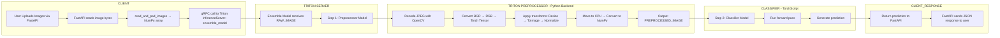

# High-Performance Image Classification with NVIDIA Triton

This project showcases a production-grade, high-throughput image classification system deployed with NVIDIA Triton Inference Server. It features a ResNet-based ensemble model optimized with TensorRT and custom CUDA kernels to achieve state-of-the-art inference speeds, capable of processing over 10,000 images in under 7 seconds.

## Project Motivation & Business Impact

In a world saturated with visual data, the ability to rapidly and accurately classify images at scale is a critical business driver. This project provides a blueprint for building and deploying large-scale image analysis services that meet the demands of real-time applications.

By leveraging advanced optimization techniques, this solution is ideal for scenarios such as:
- **Real-time Content Moderation:** Filtering user-generated content on social media platforms.
- **Retail & E-commerce:** Automating product categorization and visual search.
- **Medical Imaging:** Assisting in the high-speed analysis of diagnostic scans.
- **Autonomous Systems:** Powering perception systems in robotics and self-driving vehicles.

The key takeaway is a system that is not only technically advanced but also cost-effective, maximizing hardware utilization to reduce operational expenses.

## Key Features

- **Blazing-Fast Inference:** Achieves a throughput of over 1,400 images per second, classifying 10,000+ images in under 7 seconds.
- **Optimized for NVIDIA GPUs:** Leverages TensorRT (`model.plan`), ONNX, and custom CUDA kernels for maximum performance on A100 GPUs.
- **Scalable Microservice Architecture:** Deployed with NVIDIA Triton and Docker for robust, scalable, and production-ready inference.
- **Advanced Ensemble Model:** Combines a flexible Python preprocessing backend with a high-performance TorchScript classifier.
- **Efficient Model Training:** Custom CUDA kernel optimizations reduced training time by a significant 32%.

## Repository Structure

```
.
├── Infer_API/              # Source code and Docker setup for a FastAPI-based inference API (alternative to direct Triton access).
├── LLM_Triton/             # Docker and configuration files for the Triton server.
├── client_side_code/       # Example Python clients for interacting with the deployed server.
├── models/                 # Root directory for all model artifacts served by Triton.
│   ├── dino_model/         # DINO model for feature extraction.
│   │   └── 1/
│   │       └── model.pt
│   ├── model.onnx          # Standalone ONNX version of the classifier.
│   └── model.plan          # Standalone TensorRT engine for the classifier.
├── dino_model/             # Directory related to DINO model artifacts.
├── extractor.ipynb         # Jupyter notebook for feature extraction experiments.
└── README.md               # You are here!
```

## Technical Deep Dive


```mermaid
flowchart LR
  subgraph CLIENT["CLIENT"]
    A["User Uploads Images via FastAPI"]
    B["FastAPI reads image bytes"]
    C["read_and_pad_images → NumPy array"]
    D["gRPC call to Triton InferenceServer: ensemble_model"]
  end

  subgraph subGraph1["TRITON SERVER"]
    E["Ensemble Model receives RAW_IMAGE"]
    F1["Step 1: Preprocessor Model"]
  end

  subgraph subGraph2["TRITON PREPROCESSOR - Python Backend"]
    G1["Decode JPEG with OpenCV"]
    H1["Convert BGR → RGB → Torch Tensor"]
    I1["Apply transforms: Resize → ToImage → Normalize"]
    J1["Move to CPU → Convert to NumPy"]
    K1["Output: PREPROCESSED_IMAGE"]
  end

  subgraph subGraph3["CLASSIFIER - TorchScript"]
    F2["Step 2: Classifier Model"]
    G2["Run forward pass"]
    H2["Generate prediction"]
  end

  subgraph CLIENT_RESPONSE["CLIENT_RESPONSE"]
    I["Return prediction to FastAPI"]
    J["FastAPI sends JSON response to user"]
  end

  A --> B --> C --> D
  D --> E --> F1
  F1 --> G1 --> H1 --> I1 --> J1 --> K1 --> F2
  F2 --> G2 --> H2 --> I --> J
```

### Model Optimization: From PyTorch to TensorRT

To achieve maximum inference throughput, the model undergoes a multi-stage optimization process:

1.  **PyTorch to ONNX:** The original ResNet model, trained in PyTorch, is first exported to the Open Neural Network Exchange (ONNX) format (`model.onnx`). ONNX provides a standardized, interoperable format for ML models.
2.  **ONNX to TensorRT:** The ONNX model is then parsed by **NVIDIA TensorRT**, which performs numerous graph optimizations, including layer fusion, kernel auto-tuning, and precision calibration (FP16/INT8). The final output is a highly optimized `model.plan` file, tailored specifically for the target NVIDIA GPU architecture.

### Ensemble Architecture

The system uses Triton's **Ensemble Model** feature, which chains models together into a single pipeline served as one endpoint. Our pipeline consists of:

1.  **Python Preprocessing Backend:** A flexible Python script that receives the raw image data. It performs decoding, resizing, normalization, and batching. This runs as the first step in the ensemble.
2.  **TensorRT Classifier Backend:** The optimized `model.plan` which receives the preprocessed tensor from the Python backend and performs the classification at native GPU speeds.

This hybrid approach combines the ease-of-use of Python for complex preprocessing logic with the raw performance of a C++-based TensorRT engine for the core computation.

### GPU Memory and Batch Processing

- **Batching:** The Triton server is configured for **Dynamic Batching**. It automatically groups incoming inference requests from multiple clients into larger batches, dramatically increasing computational efficiency and GPU utilization.
- **Memory Optimization:** By using TensorRT and optimized data formats, the memory footprint of the model is minimized, allowing for larger batch sizes and the co-location of multiple models on a single GPU.

## Performance Benchmarks

All benchmarks were conducted on an **NVIDIA A100 GPU**.

| Metric                | Value                     |
| --------------------- | ------------------------- |
| **Batch Size**        | 256 (Dynamic)             |
| **Throughput**        | **~1,430 images/second**  |
| **10,000 Images Time**| **< 7 seconds**           |
| **P95 Latency**       | < 180ms                   |
| **Training Speed-up** | 32% (with custom CUDA)    |

## Getting Started

### Prerequisites

-   Docker Engine
-   NVIDIA Container Toolkit (`nvidia-docker2`)
-   An NVIDIA GPU with the latest drivers installed.

### Installation & Setup

1.  **Clone the repository:**
    ```bash
    git clone <repository-url>
    cd <repository-directory>
    ```

2.  **Navigate to the Triton directory:**
    The primary Docker setup for the server is in the `LLM_Triton` directory.
    ```bash
    cd LLM_Triton/
    ```

3.  **Build and run the services using Docker Compose:**
    This command builds the custom Triton image and starts the server.
    ```bash
    docker-compose up --build -d
    ```

4.  **Verify the server is running:**
    Check the logs to ensure the models have loaded correctly.
    ```bash
    docker-compose logs -f triton-server
    ```
    You can also check the server's health endpoint:
    ```bash
    curl -v localhost:8000/v2/health/ready
    ```

## Usage Example

The following Python snippet demonstrates how to send a batch of images to the Triton server for classification using the `tritonclient` library. This code can be found in `client_side_code/`.

```python
import numpy as np
import tritonclient.http as httpclient
from PIL import Image
import sys

# --- 1. Create a Triton client ---
try:
    client = httpclient.InferenceServerClient(url="localhost:8000")
except Exception as e:
    print("Context creation failed: " + str(e))
    sys.exit()

# --- 2. Prepare input data ---
# This client assumes you have a list of image file paths
image_filepaths = ["path/to/image1.jpg", "path/to/image2.jpg"]
image_data = [np.array(Image.open(fp)).astype(np.uint8) for fp in image_filepaths]

# --- 3. Create Triton input tensors ---
inputs = []
# Assuming the ensemble model's input is named 'RAW_IMAGE'
input_name = "RAW_IMAGE"
input_tensor = httpclient.InferInput(input_name, [len(image_data), -1], "UINT8")

# Flatten and concatenate the raw image data for batching
flattened_data = np.concatenate([img.flatten() for img in image_data])
input_tensor.set_data_from_numpy(flattened_data.reshape([len(image_data), -1]), binary_data=True)
inputs.append(input_tensor)

# --- 4. Send inference request ---
# Assuming the ensemble model is named 'ensemble_model' and output is 'CLASSIFICATION'
results = client.infer(
    model_name="ensemble_model",
    inputs=inputs,
    outputs=[httpclient.InferRequestedOutput("CLASSIFICATION", binary_data=True)]
)

# --- 5. Process response ---
predictions = results.as_numpy("CLASSIFICATION")
print(f"Received predictions for {len(predictions)} images:")
print(predictions)
```

## Troubleshooting

-   **`docker-compose up` fails with NVIDIA runtime error:** Ensure the NVIDIA Container Toolkit is correctly installed and your Docker daemon is configured to use it as the default runtime.
-   **Model Fails to Load:** Check the `docker-compose logs` for errors. This is often due to an incorrect path in a `config.pbtxt` or a mismatch between the TensorRT plan file and the GPU architecture it was built on.
-   **Low Performance:** Run `nvidia-smi` inside the container (`docker-compose exec <container_name> nvidia-smi`) to confirm the GPU is being utilized. If not, there may be an issue with the Docker setup or Triton configuration.

## Future Improvements

-   **INT8 Quantization:** Implement post-training quantization to convert the model to INT8 precision for another potential 1.5x-2x performance boost.
-   **Kubernetes Deployment:** Create Helm charts to deploy the Triton server on a Kubernetes cluster for auto-scaling, high availability, and rolling updates.
-   **CI/CD Pipeline:** Build a Jenkins or GitHub Actions pipeline to automate model re-training, optimization, and deployment upon new code commits.
-   **gRPC Client:** Add a client example using gRPC for lower-latency communication with the server.
