# 🧠 Triton Inference Server Deployment Guide

This guide provides a quick and effective setup for deploying models using NVIDIA Triton Inference Server with Docker. It also covers model repository structure, configuration files, and known limitations.

---

```mermaid
flowchart TD
  subgraph CLIENT["CLIENT"]
    A["User Uploads Images via FastAPI"]
    B["FastAPI reads image bytes"]
    C["read_and_pad_images → NumPy array"]
    D["gRPC call to Triton InferenceServer: ensemble_model"]
  end

  subgraph subGraph1["TRITON SERVER"]
    E["Ensemble Model receives RAW_IMAGE"]
    F1["Step 1: Preprocessor Model"]
  end

  subgraph subGraph2["TRITON PREPROCESSOR - Python Backend"]
    G1["Decode JPEG with OpenCV"]
    H1["Convert BGR → RGB → Torch Tensor"]
    I1["Apply transforms: Resize → ToImage → Normalize"]
    J1["Move to CPU → Convert to NumPy"]
    K1["Output: PREPROCESSED_IMAGE"]
  end

  subgraph subGraph3["CLASSIFIER - TorchScript"]
    F2["Step 2: Classifier Model"]
    G2["Run forward pass"]
    H2["Generate prediction"]
  end

  subgraph CLIENT_RESPONSE["CLIENT_RESPONSE"]
    I["Return prediction to FastAPI"]
    J["FastAPI sends JSON response to user"]
  end

  A --> B --> C --> D
  D --> E --> F1
  F1 --> G1 --> H1 --> I1 --> J1 --> K1 --> F2
  F2 --> G2 --> H2 --> I --> J
```




## 🚀 Quick Start


Before starting a server we need to ensure the Repository structure is correct

### Model Repository Structure

The Repository structure depends on the model,

##### pytorch_libtorch 

For a pytorch_libtorch model, organize your repository as:

models/
└── classifier/
    ├── 1/
    │   └── model.pt
    └── config.pbtxt


### config.pbtxt

```protobuf
name: "classifier" 
platform: "pytorch_libtorch" # To tell which backend to use
max_batch_size: 4096 # Maximum Batch Size to expect

instance_group [
  {
    count: 2  # To tell how many copies of the model you want
    kind: KIND_GPU # CPU or GPU
    gpus: [0, 1]  # How many GPU to expect. [0] means one 1 GPU
  }
]

dynamic_batching { # Change this according to your needs
  preferred_batch_size: [32, 64, 128, 256, 512, 1024]
  max_queue_delay_microseconds: 100
}

input [  # Change this according to your model
  {
    name: "input__0"
    data_type: TYPE_FP32
    format: FORMAT_NCHW
    dims: [3, 224, 224]
  }
]

output [ # Change this according to your model
  {
    name: "output__0"
    data_type: TYPE_FP32
    dims: [5]
  }
]

response_cache {  # Optional
  enable: true
}
```


Run the following Docker command to start the Triton Inference Server on a specific GPU:

```bash
docker run --gpus="device=1" --rm \
  -p 8000:8000 -p 8001:8001 -p 8002:8002 \
  -v ~/models:/models \
  nvcr.io/nvidia/tritonserver:24.02-py3 \
  tritonserver --model-repository=/models
```
To install with python libraries:
```bash
docker run --gpus="device=3" --rm --shm-size=4g   -p 8000:8000 -p 8001:8001 -p 8002:8002   -v $(pwd)/models:/models   nvcr.io/nvidia/tritonserver:24.02-py3   bash -c "pip install numpy t
orchvision opencv-python-headless && tritonserver --model-repository=/models"
```

Arguments Explained:

--gpus="device=1" → Use GPU 1 , Change this to --gpus=all to use all GPUs

-v ~/models:/models → Mount local model repository

--model-repository=/models → Path inside the container

Ports:

8000: HTTP → Use to make Restfull APIs

8001: gRPC 

8002: Prometheus metrics


# Limitations

1. FastAPI (Client Side)
        Max number of files per request: 1000

2. Triton gRPC Client
        Max request size: 2GB